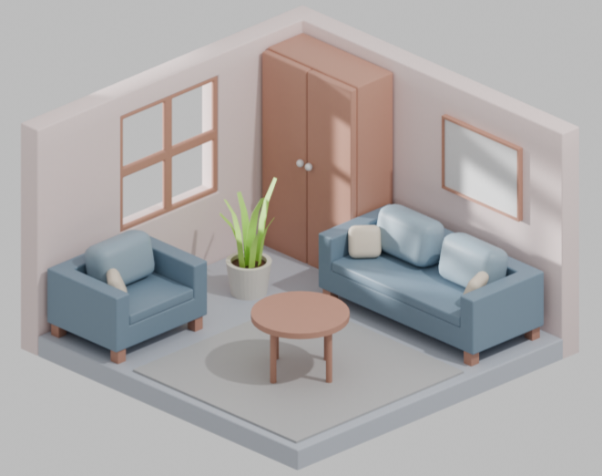
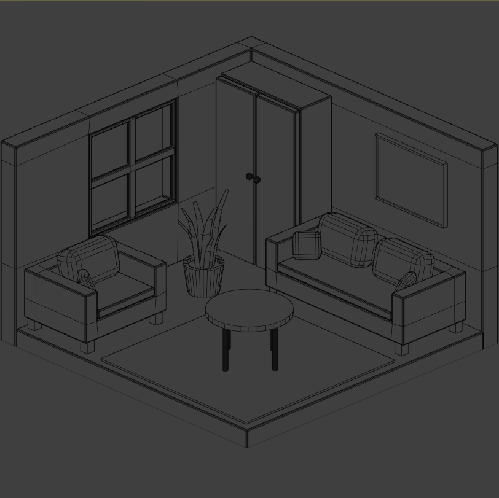
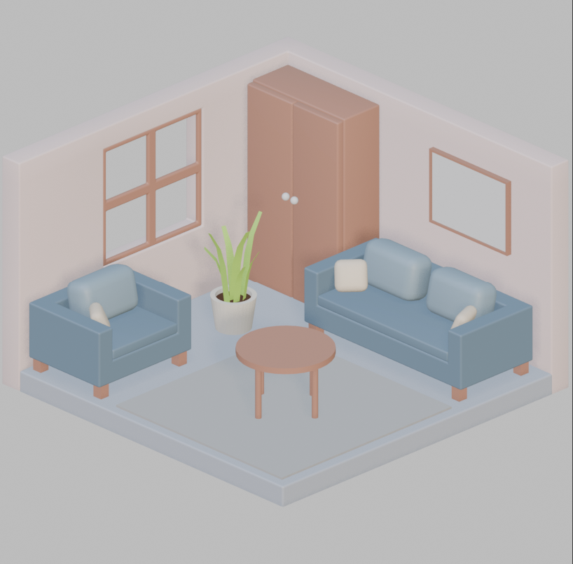

# Modern Isometric Living Room

A 3D interior visualization created in Blender.

## Software Used
- Blender
- Cycles Renderer

## Skills Practiced
- Interior modelling
- Furniture modelling
- Material creation
- Lighting setup
- Camera composition

## Project Process

1. Room blockout
2. Furniture modelling
3. Material setup
4. Lighting and rendering

## Final Render

## Viewport Process

## Material Process 

